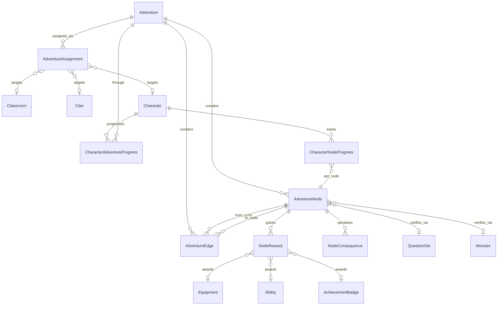

# Adventures Quest Map System — Roadmap

> Status: **Draft v1** — proposal document  
> Author: prepared for Legends of Learning  
> Last updated: 2026-05-21

This roadmap defines a brand-new map-based quest system codenamed **"Adventures"** that will be built **in parallel** with the legacy `Quest` / `QuestLog` system. The legacy system stays fully intact and untouched; the new system lives in its own tables, blueprints, templates, and JS, mounted under `/teacher/adventures` and `/student/adventures`.

---

## Table of contents

1. [Executive summary](#1-executive-summary)
2. [Vision and user stories](#2-vision-and-user-stories)
3. [Glossary](#3-glossary)
4. [Current state analysis (what we have today)](#4-current-state-analysis-what-we-have-today)
5. [Architectural decisions](#5-architectural-decisions)
6. [Data model](#6-data-model)
7. [Entity-relationship diagram (mermaid)](#7-entity-relationship-diagram-mermaid)
8. [Teacher map editor](#8-teacher-map-editor)
9. [Student map experience](#9-student-map-experience)
10. [Node verification and completion flow](#10-node-verification-and-completion-flow)
11. [Reward and consequence model](#11-reward-and-consequence-model)
12. [API surface (Flask blueprint design)](#12-api-surface-flask-blueprint-design)
13. [Integration touchpoints with existing systems](#13-integration-touchpoints-with-existing-systems)
14. [Authoring UX details](#14-authoring-ux-details)
15. [Edge cases and gotchas](#15-edge-cases-and-gotchas)
16. [Validation rules](#16-validation-rules)
17. [Phased roadmap](#17-phased-roadmap)
18. [Definition of done per phase](#18-definition-of-done-per-phase)
19. [Testing strategy](#19-testing-strategy)
20. [Risks and mitigations](#20-risks-and-mitigations)
21. [Open questions for the team](#21-open-questions-for-the-team)
22. [Appendix A — ASCII mockups](#22-appendix-a--ascii-mockups)
23. [Appendix B — Example JSON payloads](#23-appendix-b--example-json-payloads)
24. [Appendix C — File / directory layout proposal](#24-appendix-c--file--directory-layout-proposal)

---

## 1. Executive summary

The current quest system in `Legends-of-Learning-4` is a flat table-driven list with single-parent prerequisites. Teachers configure quests via a long Bootstrap form with raw JSON textareas; students see a sidebar list, not a map. There is no spatial / map authoring, no branching, and no choice-driven paths.

**Adventures** replaces that mental model:

- A teacher opens the **Adventure Editor**, picks a background image (e.g. a fantasy region map), and clicks anywhere to drop **nodes**. Each node is a task — a battle, a quiz, a story beat, a treasure, a choice, or a milestone.
- The teacher draws **edges** between nodes to define the order: linear chains, branches ("go left or right"), parallel side paths, and convergent re-joins are all supported via a directed graph.
- The teacher then **assigns** the adventure to a class, a clan, or an individual student.
- The student opens the adventure, sees the same map their teacher drew, and walks a glowing character marker between nodes — unlocking, attempting, completing, and unlocking more as they go.
- Completion of a node atomically distributes rewards (XP, gold, equipment, abilities, badges) and applies any consequences on failure, audit-logged for teacher visibility.

This is being built **in parallel** with the legacy system. No code, schema, or templates from the legacy `Quest` / `QuestLog` flow are modified.

---

## 2. Vision and user stories

### Teacher

- *As a teacher,* I want to drag-and-drop quest nodes onto a fantasy map so that authoring feels visual and intuitive instead of filling out JSON.
- *As a teacher,* I want to draw an edge from one node to two follow-up nodes so that students can choose which task to do next.
- *As a teacher,* I want to mark some side nodes as optional so that students can earn bonus rewards without blocking their progress.
- *As a teacher,* I want to reuse an adventure I built last term with a different class so I don't repeat work.
- *As a teacher,* I want to see live progress for each student on every node — who is stuck, who is sprinting ahead, who failed and needs help.

### Student

- *As a student,* I want to open my adventure and see my character marker on a beautiful map showing where I've been and where I can go next.
- *As a student,* I want completed nodes to glow gold, my available nodes to pulse, and locked nodes to be greyed out, so the next step is obvious.
- *As a student,* I want to choose between two paths at a fork and live with the consequences of my choice.
- *As a student,* I want a small travel animation when I complete a node so progress feels rewarding.
- *As a student,* I still want to see the rewards I'll earn before I start a node, so I can decide whether to attempt it now.

### Admin / future

- *As an admin,* I want to clone or import adventures from other teachers so good content spreads across the school.
- *As an admin,* I want analytics across all adventures showing which nodes are difficulty spikes.

---

## 3. Glossary

| Term | Definition |
|---|---|
| **Adventure** | A reusable, teacher-authored map template. Contains a background image, a set of nodes, and edges between them. |
| **Node** | A single placed task on the map. Has a type (battle, quiz, story, choice, reward, milestone, boss, end), a position, and verification rules. |
| **Edge** | A directed connection from one node to another. Can be unconditional ("always") or conditional (e.g. only follow if a choice is made or a score threshold is met). |
| **Start node** | A node with no inbound edges (or explicitly flagged `is_start`). At least one is required. |
| **End node** | A node with no outbound edges (or explicitly flagged `is_end`). Completion of any end node may complete the adventure (configurable). |
| **Choice node** | A node whose completion forces the student to pick exactly one outbound edge. |
| **Branch** | Two or more outbound edges from the same node. May be "all unlock" (parallel) or "pick one" (choice). |
| **Path** | A sequence of nodes a particular student took through the graph. |
| **Assignment** | A binding of an Adventure to a target (class, clan, or character) with an active window. |
| **Progress** | A pair of records — one per character per adventure, and one per character per node — capturing status, attempts, and outcomes. |
| **Snapshot** | A frozen copy of an Adventure's nodes and edges taken at assignment time so mid-flight edits don't corrupt student progress. |

---

## 4. Current state analysis (what we have today)

### 4.1 Existing schema (legacy — will not be modified)

In [`app/models/quest.py`](../app/models/quest.py):

- `Quest` — id, title, description, `type` (enum: story/daily/weekly/achievement/event), `level_requirement`, `requirements` (JSON), `completion_criteria` (JSON), `start_date`, `end_date`, `time_limit_hours`, `parent_quest_id` (self-FK, single parent only — strictly a tree, not a DAG), optional `question_set_id`, optional `monster_id`.
- `QuestLog` — id, character_id, quest_id, status (not_started / in_progress / completed / failed), `progress_data` JSON, `started_at`, `completed_at`, **`x_coordinate` / `y_coordinate`** (per-character coords on a 10×10 grid, auto-assigned by [`app/services/quest_map_utils.py`](../app/services/quest_map_utils.py)).
- `Reward` — id, quest_id, type (xp/gold/equipment/ability/clan_xp/special_currency), amount, item_id, ability_id.
- `Consequence` — id, quest_id, description, experience_penalty, gold_penalty, health_penalty.

### 4.2 Existing UI (legacy — will not be modified)

- Teacher list view: [`app/templates/teacher/quests.html`](../app/templates/teacher/quests.html) — a Bootstrap table.
- Teacher edit form: [`app/templates/teacher/quest_form.html`](../app/templates/teacher/quest_form.html) — long form with raw JSON textareas for requirements and completion criteria.
- Teacher chain view: [`app/templates/teacher/quest_chain.html`](../app/templates/teacher/quest_chain.html) — linear text breadcrumb of parent → child quests.
- Teacher progress view: [`app/templates/teacher/quest_progress.html`](../app/templates/teacher/quest_progress.html) — table of student progress.
- Student view: [`app/templates/student/quests_new.html`](../app/templates/student/quests_new.html) — sidebar quest log + details panel. Uses [`static/images/quest_maps/quest_map.png`](../static/images/quest_maps/quest_map.png) as a backdrop but **does not render a map** — the foreground is a list UI.

### 4.3 Backend wiring

- Teacher blueprint: [`app/routes/teacher/quests.py`](../app/routes/teacher/quests.py) — CRUD, assignment, chain view, progress view.
- Student routes: in [`app/routes/student_main.py`](../app/routes/student_main.py) — `/student/quests`, `/student/quests/start/<id>`, `/student/quests/complete/<id>`.
- Map coord helper: [`app/services/quest_map_utils.py`](../app/services/quest_map_utils.py) — left-to-right, top-to-bottom scan over a 10×10 grid per character.
- Reward distribution: `Reward.distribute()` and `Consequence.apply()` — atomic, in-session, no premature commits. **Good pattern, will be mirrored.**

### 4.4 What works well and we will keep as inspiration

- Atomic reward distribution with audit logging.
- `RewardType` enum and the existing equipment/ability integration via `Inventory` and `CharacterAbility`.
- `question_set_id` / `monster_id` FK approach as a clean way to attach verification artefacts.
- The single per-character `*_log` table that consolidates progress + attempts.

### 4.5 What is broken / missing for what we want

- **Single-parent prerequisite only.** Strict tree, no DAG, no branching, no merging, no choices.
- **Coordinates live on `QuestLog`,** not on the template. Teachers cannot author positions; coords are auto-placed per character.
- **No notion of node type beyond two optional FKs.** Battle / quiz / story / choice / milestone / boss / reward are not first-class.
- **No teacher map editor.** Authoring is form + JSON, not visual.
- **Student view is not a map.** It is a sidebar + detail panel.
- **No choice mechanics.** No way to encode "if student chose path A, unlock node X but not node Y."
- **No conditional edges.** Cannot say "only unlock the next node if the quiz was passed with >=80%."
- **No snapshot at assignment.** Editing a parent quest mid-term silently changes the student's experience.
- **Quest chain visualization** is a flat HTML breadcrumb in [`quest_chain.html`](../app/templates/teacher/quest_chain.html), not a graph.

---

## 5. Architectural decisions

The following decisions are **locked in** for this design and were confirmed with the user before this document was written:

| Decision | Choice | Why |
|---|---|---|
| Build mode | **Parallel** | Lowest risk. Legacy quests stay intact. New domain has its own tables, routes, templates, JS, and URL prefix. No data migration in v1. |
| Map scope | **Adventure = reusable template** | A teacher authors one map; assignment broadcasts it; per-character progress is tracked independently. Maximises reuse, minimises authoring burden, matches the user's mental model. |
| Graph topology | **Directed acyclic graph (DAG)** | Trees are too restrictive (no merges). Cycles are confusing pedagogically. Validation will warn on cycles. |
| Multi-prerequisite semantics | **All inbound completed = unlocked (AND)** by default, with a per-edge override for "any inbound completed (OR)" | Simplest default; OR semantics needed for re-join nodes after a branch. |
| Snapshotting | **Snapshot on assignment** (Phase 4) | Students mid-flight are not destabilised by teacher edits. Adventure has a `version` column; assignment captures the version. |
| Frontend stack | **Vanilla JS + SVG + Tailwind** for v1, with an explicit upgrade path to React Flow if complexity demands it | Consistent with existing Flask + Jinja + Tailwind codebase, no build pipeline. |
| Auth / scoping | Teachers see their own Adventures by default; Adventures can be `is_public` to be visible to other teachers in the same school | Encourages sharing, doesn't force it. |
| URL space | `/teacher/adventures/...` and `/student/adventures/...` | Distinct from `/teacher/quests/...` so coexistence is obvious. |

---

## 6. Data model

All new tables. No FK into legacy `quests` or `quest_logs`. Suffixed comments indicate Alembic migration ordering.

### 6.1 `adventures`

The map template.

| Column | Type | Notes |
|---|---|---|
| `id` | int PK | |
| `title` | varchar(128) | required |
| `description` | text | |
| `teacher_id` | int FK → `users.id` ON DELETE SET NULL | author / owner |
| `background_image_url` | varchar(512) | path under `/static` or full URL |
| `theme` | varchar(32) | e.g. "fantasy", "scifi", "modern" — affects default node icons |
| `width` | int | logical map width in px (default 2000) |
| `height` | int | logical map height in px (default 1500) |
| `status` | enum('draft','published','archived') | default 'draft' |
| `is_public` | bool | visible to other teachers in the school |
| `version` | int | bumped on any structural edit while published; used for snapshotting |
| `created_at` / `updated_at` | datetime | |

Indexes: `(teacher_id)`, `(status, is_public)`.

### 6.2 `adventure_nodes`

A placed node on the map.

| Column | Type | Notes |
|---|---|---|
| `id` | int PK | |
| `adventure_id` | int FK → `adventures.id` ON DELETE CASCADE | |
| `slug` | varchar(64) | stable string id for referencing in JSON / URLs; unique per adventure |
| `title` | varchar(128) | shown to student |
| `description` | text | |
| `lore` | text | optional flavour text shown in node detail panel |
| `icon_url` | varchar(512) | overrides default icon for the node type |
| `node_type` | enum | start / story / battle / quiz / choice / reward / milestone / boss / end |
| `x` | float | logical map x in px |
| `y` | float | logical map y in px |
| `is_optional` | bool | optional side nodes don't block end-of-adventure completion |
| `question_set_id` | int FK → `question_sets.id` SET NULL | for quiz/battle nodes |
| `monster_id` | int FK → `monsters.id` SET NULL | for battle nodes |
| `completion_rules` | JSON | e.g. `{ "min_score_percent": 80, "max_attempts": 3 }` |
| `on_complete_actions` | JSON | e.g. `{ "narrate": "You found the relic!", "award_badge_id": 12 }` |
| `created_at` / `updated_at` | datetime | |

Constraints: `UNIQUE (adventure_id, slug)`.  
Indexes: `(adventure_id)`, `(adventure_id, node_type)`.

### 6.3 `adventure_edges`

A directed connection between two nodes within the same adventure.

| Column | Type | Notes |
|---|---|---|
| `id` | int PK | |
| `adventure_id` | int FK → `adventures.id` ON DELETE CASCADE | denormalised for indexing |
| `from_node_id` | int FK → `adventure_nodes.id` ON DELETE CASCADE | |
| `to_node_id` | int FK → `adventure_nodes.id` ON DELETE CASCADE | |
| `label` | varchar(128) | shown on the edge (e.g. "If you side with the orcs") |
| `condition_type` | enum | `always` / `choice` / `criteria` |
| `condition_data` | JSON | for `choice`: `{ "choice_key": "left" }`; for `criteria`: `{ "min_score_percent": 80 }` |
| `unlock_semantics` | enum | `and` (default) / `or` — when a target node has multiple inbound edges, do we need ALL or ANY to be satisfied to unlock? Per-edge so re-join nodes can mix. |
| `sort_order` | int | for UI ordering of choices |
| `created_at` | datetime | |

Constraints: `UNIQUE (from_node_id, to_node_id)`, `CHECK (from_node_id != to_node_id)`.  
Indexes: `(adventure_id, from_node_id)`, `(adventure_id, to_node_id)`.

### 6.4 `node_rewards`

Rewards tied to a node. Mirrors legacy `Reward` but keyed off `node_id`.

| Column | Type | Notes |
|---|---|---|
| `id` | int PK | |
| `node_id` | int FK → `adventure_nodes.id` ON DELETE CASCADE | |
| `type` | enum | experience / gold / equipment / ability / clan_experience / special_currency / badge |
| `amount` | int | |
| `item_id` | int FK → `equipment.id` SET NULL | |
| `ability_id` | int FK → `abilities.id` SET NULL | |
| `badge_id` | int FK → `achievement_badge.id` SET NULL | |
| `is_conditional` | bool | if true, only awarded when `condition_json` is met |
| `condition_json` | JSON | e.g. `{ "min_score_percent": 90 }` for "excellent" bonus |

Index: `(node_id)`.

### 6.5 `node_consequences`

Penalties applied when a node is failed.

| Column | Type | Notes |
|---|---|---|
| `id` | int PK | |
| `node_id` | int FK → `adventure_nodes.id` ON DELETE CASCADE | |
| `description` | text | |
| `xp_penalty` | int | |
| `gold_penalty` | int | |
| `hp_penalty` | int | |
| `custom_json` | JSON | room for future penalty types |

### 6.6 `adventure_assignments`

Binds an Adventure to a target.

| Column | Type | Notes |
|---|---|---|
| `id` | int PK | |
| `adventure_id` | int FK → `adventures.id` ON DELETE CASCADE | |
| `adventure_version` | int | snapshotted version at assignment time |
| `classroom_id` | int FK → `classrooms.id` SET NULL | nullable |
| `clan_id` | int FK → `clans.id` SET NULL | nullable |
| `character_id` | int FK → `characters.id` SET NULL | nullable |
| `assigned_by_user_id` | int FK → `users.id` SET NULL | |
| `starts_at` / `ends_at` | datetime | optional active window |
| `is_active` | bool | soft-disable without deleting |
| `created_at` | datetime | |

Constraint: exactly one of `classroom_id`, `clan_id`, `character_id` must be non-null (enforced in app code; a SQL `CHECK` will be added where the DB supports it).

Index: `(adventure_id, is_active)`, `(classroom_id, is_active)`, `(character_id, is_active)`.

### 6.7 `character_adventure_progress`

Per-character progress through an adventure.

| Column | Type | Notes |
|---|---|---|
| `id` | int PK | |
| `character_id` | int FK → `characters.id` ON DELETE CASCADE | |
| `adventure_id` | int FK → `adventures.id` ON DELETE CASCADE | |
| `assignment_id` | int FK → `adventure_assignments.id` SET NULL | which assignment created this progress |
| `snapshot_json` | JSON | optional: copy of the adventure's nodes + edges at start (Phase 4+) |
| `status` | enum | not_started / in_progress / completed / abandoned |
| `current_node_id` | int FK → `adventure_nodes.id` SET NULL | last node the student was on |
| `started_at` / `completed_at` / `last_active_at` | datetime | |

Constraint: `UNIQUE (character_id, adventure_id)`.  
Index: `(character_id, status)`.

### 6.8 `character_node_progress`

Per-character per-node progress.

| Column | Type | Notes |
|---|---|---|
| `id` | int PK | |
| `character_id` | int FK → `characters.id` ON DELETE CASCADE | |
| `node_id` | int FK → `adventure_nodes.id` ON DELETE CASCADE | |
| `status` | enum | locked / available / in_progress / completed / failed / skipped |
| `attempts` | int | default 0 |
| `score` | int | nullable, last attempt's score for criteria-based completion |
| `progress_data` | JSON | task-specific (e.g. battle id, quiz answers) |
| `choice_made` | varchar(64) | for choice nodes — which `choice_key` was selected |
| `started_at` / `completed_at` | datetime | |

Constraint: `UNIQUE (character_id, node_id)`.  
Indexes: `(character_id, status)`, `(node_id, status)`.

### 6.9 (Future) `adventure_co_op_progress`

Out of scope for v1. Reserved for clan-shared progress in a later phase.

---

## 7. Entity-relationship diagram (mermaid)



---

## 8. Teacher map editor

### 8.1 URL and template

- URL: `GET /teacher/adventures/<int:adventure_id>/edit`
- Template: `app/templates/teacher/adventure_editor.html`
- JS: `static/js/adventure_editor.js`
- CSS: `static/css/adventure_editor.css`

### 8.2 Recommended technology choice

There are three credible options. After weighing each against the project's existing Flask + Jinja + Tailwind stack, the recommendation is option **A**.

- **Option A — Vanilla JS + SVG + Tailwind (RECOMMENDED).** Background image rendered as `` inside a relatively-positioned `<div>`. Nodes rendered as absolutely-positioned `<div>`s with Tailwind utility classes. Edges rendered as `<path>` elements in an overlay `<svg>` with `pointer-events: none` for the SVG itself but enabled on individual paths. Pan and zoom implemented with CSS transforms on the outer container. State managed by a small `AdventureEditorStore` JS module.
  - Pros: No build step. Same stack as the rest of the teacher pages. Easy to deploy. Bundle stays tiny.
  - Cons: We hand-write drag, snap, hit-testing, and bezier-edge rendering.
- **Option B — React Flow.** Industry-standard React component for DAG editors. We'd add React + a single-page bundler (Vite or esbuild) just for this page.
  - Pros: Excellent DX. Selection, pan, zoom, mini-map, snap, edge-routing all built in.
  - Cons: Introduces a build pipeline to a Flask app that doesn't currently have one. New mental model for the codebase.
- **Option C — JointJS.** Diagramming library, heavier than React Flow but no React dependency.
  - Pros: No React. Powerful.
  - Cons: API surface is large; styling to match Tailwind requires significant work; commercial-friendly license but worth re-checking.

**Recommendation: start with Option A.** If implementation reveals the SVG/edge-routing burden is excessive, the API surface (see §12) is JSON-first so a React Flow rewrite of just the editor page is straightforward.

### 8.3 UI surfaces

```
+--------------------------------------------------------------+
|  [<- Back]  Adventure: "The Lost Library"   [Save] [Publish] |
+------+-------------------------------------------------------+
|      |                                                       |
| Tool |     +---------+   +---------+                          |
| bar  |     | Start   |---| Quiz    |                          |
|      |     +---------+   +----+----+                          |
| (-)  |                        |                              |
| Start|                        v                              |
| Story|                   +---------+                         |
| Battl|                   | Choice  |                         |
| Quiz |                   +---+--+--+                         |
| Choic|                       |  |                            |
| Rewar|              left ----+  +---- right                  |
| Mile |                  v          v                         |
| Boss |             +-------+   +-------+                     |
| End  |             | Battle|   | Story |                     |
|      |             +---+---+   +---+---+                     |
| Snap |                 |           |                         |
| Grid |                 +-----+-----+                         |
| ✓    |                       v                               |
|      |                  +----------+                         |
+------+                  |   End    |                         |
                          +----------+
+--------------------------------------------------------------+
| Validation: ✓ 1 start, ✓ all reachable, ⚠ 1 optional orphan |
+--------------------------------------------------------------+
```

- **Toolbar (left):** palette of node types. Click a type, then click on the map to place. Also: snap-to-grid toggle, undo/redo, zoom to fit.
- **Map canvas (centre):** the background image + nodes + edges. Pan with click-drag on background; zoom with wheel.
- **Inspector (right, slide-out when a node/edge is selected):** edit title, description, type-specific verification fields (e.g. monster picker for battle nodes), rewards list, consequences list, choice labels for choice nodes.
- **Status bar (bottom):** validation summary.

### 8.4 Interactions

- **Place node:** click toolbar type → click map. Node spawns at click position with sensible defaults.
- **Move node:** drag.
- **Select node:** click. Opens inspector.
- **Delete node:** select + Delete key or inspector button. Confirm if it has incoming/outgoing edges.
- **Draw edge:** Shift-drag from a node's edge handle to a target node. Or "connect mode" toggle button.
- **Edit edge:** click an edge → inspector for condition_type, label, sort_order.
- **Save:** debounced auto-save every 5s; explicit Save button for confidence.
- **Publish:** transitions `status` from `draft` to `published`. Bumps `version`. Adventure becomes eligible for assignment.

### 8.5 Validation panel

Real-time validation surfaces issues:
- ❌ No start node — block publish.
- ❌ End node unreachable from any start — block publish.
- ⚠ Optional orphan node (no inbound and not a start) — warn only.
- ⚠ Cycle detected (`A → B → A`) — warn only (cycles are unusual but allowed if the teacher really wants them).
- ⚠ Choice node with fewer than 2 outbound edges — warn.
- ⚠ Node missing required verification (e.g. battle node with no monster) — warn.

---

## 9. Student map experience

### 9.1 URL and template

- URL: `GET /student/adventures/<int:adventure_id>`
- Template: `app/templates/student/adventure_map.html`
- JS: `static/js/adventure_player.js`

### 9.2 Visual states

| State | Visual |
|---|---|
| Locked | Greyed out node, lock icon overlay, no pointer cursor. |
| Available | Pulsing glow ring in the theme colour, hover lifts slightly. |
| In progress | Same as available but with a small "in progress" badge. |
| Completed | Gold ring, checkmark icon, slight fade. |
| Failed | Red ring, X icon. |
| Skipped (optional) | Dashed grey ring. |

Edges are drawn as soft bezier curves. Completed edges (both endpoints completed) animate a one-shot gold pulse. Active-but-unlocked edges have a faint glow.

### 9.3 Interactions

- Click a non-locked node → opens a **quest detail panel** (right slide-out). Reuses the existing visual language of [`app/templates/student/quests_new.html`](../app/templates/student/quests_new.html): title, type badge, description, objectives, rewards grid, action button.
- The action button text is type-aware:
  - Battle node → **"Enter Battle"** → redirects to existing battle route.
  - Quiz node → **"Take Quiz"** → redirects to quiz route (existing Battle pipeline with `question_set_id`).
  - Story node → **"Read"** → opens an in-place reader; complete on close.
  - Choice node → **"Make Your Choice"** → opens a choice panel with one button per outbound edge; selecting one records `choice_made` and completes the node.
  - Reward node → **"Open Chest"** → completes immediately and shows the rewards animation.
  - Milestone / Boss / End → contextual text.
- After completion, a brief travel animation moves the character marker from the completed node toward each newly-unlocked successor (it forks if more than one unlocks).
- Mini-map in the lower-right shows the full adventure shrunk; click to fast-jump the camera.

### 9.4 Empty / error states

- No assigned adventures → friendly empty state with reused copy from `quests_new.html`.
- Locked-by-time (`starts_at` in the future) → countdown badge.
- Past-due (`ends_at` passed) → "This adventure has ended" banner.

---

## 10. Node verification and completion flow

The flow below applies on a per-node basis. All side effects happen in a single transaction following the pattern established by `Reward.distribute()` in [`app/models/quest.py`](../app/models/quest.py).

### 10.1 Start-of-adventure

1. Student clicks an unstarted adventure on their adventures list.
2. Backend creates `character_adventure_progress` row with status=in_progress, current_node_id=<first start node>.
3. Backend creates `character_node_progress` rows for every start node with status=available; all other nodes status=locked.

### 10.2 Per node — by type

#### Story / Reward / Milestone / End

```
client → POST /student/adventures/<id>/nodes/<slug>/complete
         ↓
   verify node is available
   set node progress = completed, completed_at = now()
   distribute node_rewards in same transaction
   recompute unlocks (see §10.3)
   audit log: ADVENTURE_NODE_COMPLETE
   return {next_unlocked: [...]}
```

#### Battle

```
client → POST /student/adventures/<id>/nodes/<slug>/start
         ↓
   create Battle row (existing flow) with monster_id from node
   set node progress = in_progress, attempts++
   store battle_id in progress_data
   return {redirect: /student/battle/<battle_id>}

... battle completes via existing flow ...

server-side hook on Battle.status=WON:
   if Battle belongs to an in_progress adventure node, mark node completed
   distribute rewards, recompute unlocks
```

(The hook lives in a new service module, not as a modification of `Battle`. Detail in §13.)

#### Quiz

Two implementation options:

- **Option Q1 — reuse the existing Battle pipeline** that already accepts `question_set_id` (the pattern from `QuestLog.check_completion`).
- **Option Q2 — direct quiz route** without monster, designed for "pure quiz" nodes.

**Recommendation: Q2** for a cleaner mental model, but Q1 is acceptable in Phase 3 if time-constrained.

#### Choice

```
client → POST /student/adventures/<id>/nodes/<slug>/choose
         body: { choice_key: "left" }
         ↓
   verify node is available, node_type=choice
   set node progress completed, choice_made = body.choice_key
   recompute unlocks — only edges where condition_data.choice_key == "left" propagate
```

### 10.3 Unlock recomputation

After any node completes:

1. Fetch all outbound edges from the completed node.
2. For each edge, filter by condition:
   - `always` → propagate.
   - `choice` → propagate only if `choice_made` matches `condition_data.choice_key`.
   - `criteria` → propagate only if the node's `score` / `progress_data` satisfies `condition_data`.
3. For each propagating edge's `to_node`:
   - Inspect all inbound edges of `to_node`. Group by `unlock_semantics`:
     - `and` group: ALL satisfying edges' source nodes must be completed.
     - `or` group: ANY satisfying edge's source node completed is enough.
   - If unlock condition is met and `to_node`'s current status is `locked`, set status=available.
4. If the completed node is an end node (no outbound edges or `is_end=true`), evaluate adventure completion:
   - If all non-optional end nodes are completed (configurable: any vs all), set `character_adventure_progress.status=completed`.

### 10.4 Failure handling

- Failed battles or below-threshold quiz attempts: node progress goes to `failed`, attempts++, consequences applied if `attempts >= max_attempts`. Below max, node returns to `available` for retry.
- After max attempts on a non-optional node: adventure cannot complete; teacher can manually grant via a "force complete" admin action.

### 10.5 Audit logging

Three new `EventType` values:
- `ADVENTURE_NODE_START`
- `ADVENTURE_NODE_COMPLETE`
- `ADVENTURE_COMPLETE`

`event_data` includes adventure_id, node_id, node_type, score (if any), rewards distributed (mirroring the rich payload built in [`teacher/quests.py`](../app/routes/teacher/quests.py) `complete_quest_for_student`).

---

## 11. Reward and consequence model

### 11.1 Reward types

Mirrors `RewardType` enum from [`app/models/quest.py`](../app/models/quest.py) with one addition: **`badge`** (award an `AchievementBadge`).

### 11.2 Conditional rewards

`node_rewards.is_conditional = true` enables a `condition_json` check. Examples:

```json
{ "min_score_percent": 90 }
```
→ award only if the node's `score` ≥ 90.

```json
{ "completed_within_seconds": 120 }
```
→ award only if `completed_at - started_at` ≤ 120 s.

```json
{ "no_failed_attempts": true }
```
→ award only on first-try success.

### 11.3 Distribution

A new service module `app/services/adventure_rewards.py` exposes:

```python
def distribute_node_rewards(character, node, score=None, session=None, commit=False):
    """Atomically distribute all rewards for a node, including conditional ones."""
```

This mirrors `Reward.distribute()` but reads from `node_rewards` and handles the conditional branch. It will share private helpers with the legacy distribution code by extracting them into a small utility module (`app/services/_reward_helpers.py`) — that extraction is itself a refactor that does not change legacy behaviour.

### 11.4 Consequences

Applied on max-attempts failure. New service: `apply_node_consequences(character, node, session=None, commit=False)`. Mirrors `Consequence.apply()` from legacy.

---

## 12. API surface (Flask blueprint design)

A new blueprint, mounted at two prefixes:

```python
# app/routes/adventures/__init__.py
adventures_teacher_bp = Blueprint("adventures_teacher", __name__, url_prefix="/teacher/adventures")
adventures_student_bp = Blueprint("adventures_student", __name__, url_prefix="/student/adventures")
```

### 12.1 Teacher routes

| Method | Path | Purpose |
|---|---|---|
| GET | `/teacher/adventures/` | List all adventures owned by current teacher + public ones from peers. |
| POST | `/teacher/adventures/` | Create a new adventure (title, description, background). Returns 201 with `id`. |
| GET | `/teacher/adventures/<id>` | Read-only summary view. |
| GET | `/teacher/adventures/<id>/edit` | Map editor HTML page. |
| GET | `/teacher/adventures/<id>/graph` | JSON of `{ adventure, nodes: [...], edges: [...] }` for the editor. |
| PATCH | `/teacher/adventures/<id>` | Update adventure metadata. |
| DELETE | `/teacher/adventures/<id>` | Archive (soft delete). |
| POST | `/teacher/adventures/<id>/publish` | Transition draft → published, bump version. |
| POST | `/teacher/adventures/<id>/nodes` | Create node. Body: `{ slug, title, node_type, x, y, ... }`. |
| PATCH | `/teacher/adventures/<id>/nodes/<node_id>` | Update node (position, fields). |
| DELETE | `/teacher/adventures/<id>/nodes/<node_id>` | Delete node. Cascades edges. |
| POST | `/teacher/adventures/<id>/edges` | Create edge. Body: `{ from_node_id, to_node_id, condition_type, ... }`. |
| PATCH | `/teacher/adventures/<id>/edges/<edge_id>` | Update edge. |
| DELETE | `/teacher/adventures/<id>/edges/<edge_id>` | Delete edge. |
| POST | `/teacher/adventures/<id>/nodes/<node_id>/rewards` | Add reward. |
| DELETE | `/teacher/adventures/<id>/nodes/<node_id>/rewards/<reward_id>` | Remove reward. |
| POST | `/teacher/adventures/<id>/nodes/<node_id>/consequences` | Add consequence. |
| POST | `/teacher/adventures/<id>/assignments` | Assign to class / clan / character. |
| DELETE | `/teacher/adventures/<id>/assignments/<assignment_id>` | Unassign / deactivate. |
| GET | `/teacher/adventures/<id>/progress` | Per-student progress summary view. |
| POST | `/teacher/adventures/<id>/clone` | Duplicate an adventure (own or public). |

### 12.2 Student routes

| Method | Path | Purpose |
|---|---|---|
| GET | `/student/adventures/` | List assigned adventures with summary progress. |
| GET | `/student/adventures/<id>` | Map page (HTML). |
| GET | `/student/adventures/<id>/state` | JSON of `{ adventure, nodes, edges, my_progress }` — drives the map. |
| POST | `/student/adventures/<id>/nodes/<slug>/start` | Mark node started; for battle/quiz returns redirect URL. |
| POST | `/student/adventures/<id>/nodes/<slug>/complete` | Mark node complete (for nodes that complete without external verification). |
| POST | `/student/adventures/<id>/nodes/<slug>/choose` | For choice nodes; body `{ choice_key }`. |
| POST | `/student/adventures/<id>/nodes/<slug>/retry` | Reset failed node to available if retries remain. |

### 12.3 Response shape conventions

All JSON responses follow:

```json
{
  "ok": true,
  "data": { ... },
  "errors": []
}
```

On error:

```json
{
  "ok": false,
  "data": null,
  "errors": [
    { "code": "NODE_LOCKED", "message": "This node is not yet available." }
  ]
}
```

---

## 13. Integration touchpoints with existing systems

These are the explicit, narrow seams where the new domain reads or writes legacy data. None of them require modifying legacy code; only additive changes (new event types, new service modules, new template includes).

| Legacy artefact | How Adventures uses it | Is legacy modified? |
|---|---|---|
| `Character` ([`app/models/character.py`](../app/models/character.py)) | Read XP/gold/level; mutate via the same atomic pattern as `Reward.distribute()`. | No. |
| `Equipment` + `Inventory` | Award equipment by inserting into `inventories`. | No. |
| `Ability` + `CharacterAbility` | Award ability by inserting into `character_abilities`. | No. |
| `AchievementBadge` | Award via association table (mirrors legacy quest behaviour). | No. |
| `Battle` + `Monster` ([`app/models/battle.py`](../app/models/battle.py)) | Battle nodes create Battle rows. A post-battle hook (new service file) checks if the battle is bound to an in_progress node and completes it. | No — hook is a new module that subscribes via an explicit call inserted into the battle-completion service. If even that one-line insert is undesirable, the alternative is a polling check on student page load. **Preferred: explicit hook.** |
| `QuestionSet` + `Question` ([`app/models/education.py`](../app/models/education.py)) | Same pattern as battle for quiz nodes. | No. |
| `AuditLog` ([`app/models/audit.py`](../app/models/audit.py)) | Additive new `EventType` values: `ADVENTURE_NODE_START`, `ADVENTURE_NODE_COMPLETE`, `ADVENTURE_COMPLETE`. | Adding enum values only — no schema break. |
| `Classroom`, `Clan`, `Student` | Read for assignment scoping. | No. |
| Student sidebar nav ([`app/templates/student/_student_header.html`](../app/templates/student/_student_header.html)) | Add an "Adventures" link next to "Quests". | Minor additive template edit, no code change. |
| Teacher dashboard nav | Add an "Adventures" entry. | Additive template edit. |
| Static assets | Reuse [`static/images/quest_maps/quest_map.png`](../static/images/quest_maps/quest_map.png) and [`static/images/Backgrounds/`](../static/images/Backgrounds/) as the default Adventure background library. | No. |

### 13.1 Battle-completion hook (the only legacy seam that needs a one-line insert)

When a `Battle` transitions to status=WON in the existing battle-resolution route, we want Adventures to complete the bound node atomically with the battle's own commit. There are two ways:

1. **Explicit hook (preferred):** add a single call to `adventure_hooks.on_battle_resolved(battle)` in the battle-resolution code path. The hook is a no-op if the battle isn't tied to an adventure node.
2. **Polling (zero-touch):** student's adventure page re-checks node status on load. Simpler but laggy.

We'll go with the explicit hook; it's a one-line change to legacy battle code and the only such change in the whole roadmap.

---

## 14. Authoring UX details

- **Background image picker.** Modal with a library of seed images (`static/images/quest_maps/quest_map.png` and the `static/images/Backgrounds/Core Level Backgrounds/` tree) plus an upload-from-disk option that writes to `static/images/adventure_backgrounds/<adventure_id>/<filename>`.
- **Node icon library.** Each `node_type` ships with a default Material Icon (already used throughout the student UI). Teachers can override per-node via a small icon picker.
- **Snap-to-grid.** Toggle in toolbar; grid pitch configurable (default 25 px).
- **Auto-layout.** "Tidy" button runs a simple force-directed layout to clean up an unintentional mess.
- **Keyboard shortcuts.** Delete, Ctrl-Z, Ctrl-Y, Esc to deselect, +/− to zoom.
- **Live preview.** A "Preview as student" button opens the student player in a new tab in a sandboxed read-only mode.
- **Versioning UI.** Header shows `Draft v3` or `Published v2`; publishing creates v2 → v3 with a one-click rollback.

---

## 15. Edge cases and gotchas

- **Cycles.** Allowed but warned. Unlock recomputation must short-circuit on revisits to avoid infinite loops.
- **Editing while assigned.** Phase 4 introduces snapshot-on-assignment. Until then, all mid-flight edits are visible to students.
- **Deleting a completed node.** Forbid via UI confirmation; in DB, ON DELETE CASCADE removes per-character progress rows so we never have dangling references.
- **Two students completing concurrently.** Already-solved by the in-session, no-premature-commit reward pattern. No global locks needed.
- **Battle hook fires for a battle that has no node binding.** Hook is a no-op; safe.
- **Choice node with only one outbound edge.** Validation warning; runtime treats it as auto-pick.
- **Self-loop (`A → A`).** Disallowed by `CHECK (from_node_id != to_node_id)`.
- **Node moved off the canvas (negative coords).** Clamp in API layer.
- **Adventure deleted with active progress.** Cascade deletes progress rows; teacher gets a confirmation dialog citing affected student count.
- **Character deleted.** Cascade deletes progress rows.
- **Background image too large.** Hard limit (e.g. 5 MB) and resize on upload.
- **Race between "complete" and "retry" clicks.** Idempotent endpoints; second call returns the same state.

---

## 16. Validation rules

Editor and publish-time validation:

- At least 1 node with no inbound edges OR flagged `is_start`. **Block publish.**
- All non-optional end-flagged nodes must be reachable from at least one start node. **Block publish.**
- No orphan non-optional nodes. **Block publish.**
- Choice nodes must have ≥ 2 outbound edges with unique `choice_key`. **Warn.**
- Battle nodes must have a `monster_id`. **Warn.**
- Quiz nodes must have a `question_set_id`. **Warn.**
- Adventures with zero nodes. **Block publish.**
- All node `slug` values unique within the adventure (enforced by DB). **Block save with clear error.**

---

## 17. Phased roadmap

Each phase is sized as a rough effort estimate; adjust to team velocity. Phases are sequential but can overlap where independent.

### Phase 0 — UX spike (≈ 0.5 wk)

- Build a throwaway static HTML page with a background image, two draggable `<div>` nodes, and one SVG edge between them.
- Confirm pan / zoom feels right. Confirm SVG edge routing is tractable.
- Decision gate: vanilla JS or upgrade to React Flow.

### Phase 1 — Foundation (≈ 1.5 wk)

- Alembic migration creating the 8 new tables (§6).
- SQLAlchemy models in `app/models/adventure.py` and `app/models/adventure_progress.py`.
- Model-level tests in `tests/test_adventure_models.py` covering relationships and cascades.
- Blueprint skeletons (§12) returning 501 placeholders.
- Teacher dashboard nav entry (additive template edit).

### Phase 2 — Teacher editor MVP (≈ 2 wk)

- `/teacher/adventures/` list + create.
- Editor page (`/edit`) with map canvas, toolbar, click-to-place, drag-to-move.
- Edge drawing.
- Inspector panel for nodes (title, description, type, rewards, monster/quiz pickers).
- Save / publish endpoints wired.
- Validation panel.
- No assignment yet; no student view yet.

### Phase 3 — Student map MVP (≈ 1.5 wk)

- Assignment endpoint + teacher assignment dialog (class only; clan and individual deferred to Phase 5).
- `/student/adventures/` list.
- `/student/adventures/<id>` map page reads state and renders nodes + edges.
- Node interaction: story / reward / milestone / end nodes work end-to-end.
- Battle nodes integrate via the new battle-completion hook.
- Quiz nodes integrate.
- Reward distribution via `adventure_rewards.distribute_node_rewards`.
- Audit logging for the three new EventTypes.

### Phase 4 — Branching, choices, snapshotting (≈ 1 wk)

- Choice nodes + choice UI.
- Conditional edges (`condition_type=criteria`).
- Snapshot-on-assignment: `assignment.adventure_version` + optional `character_adventure_progress.snapshot_json`.
- Validation rules in §16 fully enforced.

### Phase 5 — Polish (≈ 1 wk)

- Travel animation between nodes.
- Mini-map.
- Mobile responsiveness pass.
- Accessibility pass (keyboard navigation in editor, screen-reader labels on the map).
- Icon picker library.
- Clan and individual student assignment targets.

### Phase 6 — Optional later (no commitment)

- Adventure cloning across teachers.
- Public sharing across schools.
- Clan-shared progress mode.
- Time-limited nodes (`completion_rules.must_complete_within_seconds`).
- Analytics dashboard for difficulty hotspots.
- Migration tool to convert legacy quests into a starter Adventure.
- Optional retirement of the legacy quest system (only if confidence is high after months of parallel use).

---

## 18. Definition of done per phase

For every phase, the following must hold before it is considered shipped:

1. All new Alembic migrations succeed against a freshly seeded dev DB via `alembic upgrade head` (per the workspace rule in `.cursor/rules/database-management.mdc`).
2. New SQLAlchemy models documented in [`.cursor/rules/database-structure.mdc`](../.cursor/rules/database-structure.mdc) so onboarding stays accurate.
3. Unit tests in `tests/` for every new model and route, all passing under `pytest`.
4. Manual smoke-test checklist (per phase) executed by the author.
5. No regressions in the legacy quest system — `pytest tests/test_quest_models.py` continues to pass untouched.
6. Linter clean (Python: project standard; JS: project standard).
7. Updated `Ideas/Adventures Quest Map System - Roadmap.md` (this file) with any deviations from the plan.

---

## 19. Testing strategy

### 19.1 Backend (pytest)

- Model tests: relationship integrity, cascade behaviour, constraints (`UNIQUE`, `CHECK`).
- Service tests: unlock recomputation algorithm (§10.3) against fixture graphs (linear, branch, choice, merge, cycle).
- Route tests: each endpoint in §12, happy path + auth-denied + invalid-input.
- Reward distribution tests: mirror existing `tests/test_quest_models.py` patterns, including atomic-rollback on failure.

### 19.2 Frontend

- Storybook or static fixture pages for each editor sub-component (toolbar, node, edge, inspector).
- Manual E2E smoke checklist per phase. Browser automation deferred unless team owns it.

### 19.3 Data integrity

- A dedicated script `scripts/check_adventure_graph_integrity.py` that flags orphan nodes, unreachable end nodes, and inconsistent progress rows. Run periodically in dev.

---

## 20. Risks and mitigations

| Risk | Likelihood | Impact | Mitigation |
|---|---|---|---|
| SVG edge routing turns out to be much harder than expected (Option A pain). | Medium | Medium | Phase 0 spike de-risks. If it stings, swap to React Flow before Phase 2. |
| Two parallel quest systems confuse teachers. | High | Low–medium | Distinct nav labels ("Quests" vs "Adventures"). Add a banner on the legacy `Quests` page after Phase 3 saying "the new map-based Adventures system is live — try it." |
| Per-character progress at scale gets slow. | Low | Medium | Indexes on `(character_id, adventure_id)` and `(character_id, node_id)` from day 1. Page student map by adventure, not by character. |
| Schema changes mid-build. | Medium | Medium | Single migration per phase; no schema edits to already-applied migrations — always add a new migration. |
| Battle-hook insert into legacy code breaks an existing test. | Low | High | Hook is a no-op for battles not bound to nodes. Tests in `tests/test_quest_models.py` cover the existing flow and must still pass. |
| Teachers want to retire the legacy system before we're ready. | Medium | Low | Decline politely; the parallel build is explicit. Retirement is Phase 6+ and gated on usage data. |
| The map editor's UX requires more iterations than budgeted. | High | Medium | Time-box Phase 2 explicitly. Ship a "good enough" editor; defer power-user features (auto-layout, keyboard shortcuts beyond delete) to Phase 5. |

---

## 21. Open questions for the team

These are decisions that don't block the start of Phase 1 but should be resolved before the dependent phase begins.

1. **Adventure visibility.** Should published Adventures be visible to other teachers in the same school by default, or only when explicitly marked `is_public`? *Recommendation: default private, opt-in public.*
2. **End-node completion semantics.** "Adventure complete" = all non-optional end nodes complete, or any one end node complete? *Recommendation: configurable per Adventure (`adventures.end_semantics` enum: `any` / `all`). Default `all`.*
3. **Clan-shared progress.** In Phase 6 or earlier? Affects schema (would add `clan_node_progress`). *Recommendation: defer to Phase 6.*
4. **Snapshotting strategy.** Full JSON snapshot per character, or just version pinning + read-through to the versioned tables? *Recommendation: version pinning for v1 simplicity; full JSON snapshot only if mid-flight teacher edits become a real problem.*
5. **Editor frontend stack.** Stick with vanilla JS + SVG, or budget for React Flow up front? *Recommendation: Phase 0 spike decides. Default vanilla.*
6. **Max adventures per teacher.** Any soft cap? *Recommendation: no cap; if abuse appears, revisit.*
7. **Map background uploads.** Should we store them under `static/` or `instance/`? *Recommendation: `static/images/adventure_backgrounds/<adventure_id>/` so they're served via the CDN-friendly static path.*
8. **Should choice-node consequences be applied to a non-chosen branch?** E.g. choosing left means losing a reward you could have gotten on the right. *Recommendation: out of scope for v1; can be encoded in `condition_data` later.*

---

## 22. Appendix A — ASCII mockups

### A.1 Teacher map editor

```
╭──────────────────────────────────────────────────────────────────────────╮
│ Adventures › The Lost Library          Draft v3   [Save] [Preview] [Publish] │
├──────┬───────────────────────────────────────────────────────┬────────────┤
│      │                                                       │ Inspector  │
│ ▼    │       ★ start                                         │            │
│ +    │       │                                               │ Title:     │
│ ──── │       ▼                                               │ ┌────────┐ │
│ 🛡   │     ⚔ goblin (battle)                                 │ │ Goblin │ │
│ ❓   │       │                                               │ └────────┘ │
│ 📜   │       ▼                                               │            │
│ ❔   │     ❓ riddle (quiz, set#3)                            │ Type:      │
│ 🎁   │       │                                               │ [Battle ▾] │
│ 🏁   │       ▼                                               │            │
│ 💀   │     ❔ trust the wizard? (choice)                     │ Monster:   │
│ 🚩   │       │  left │ right                                  │ [Goblin ▾] │
│      │       ▼       ▼                                       │            │
│ ✓Snap│     📜 lore  ⚔ ogre                                   │ Rewards:   │
│ ⤿Undo│       │       │                                       │ • 50 XP    │
│      │       └───┬───┘                                       │ • 25 GP    │
│      │           ▼                                           │ [+ Add]    │
│      │         🏁 end                                        │            │
│      │                                                       │ [Delete]   │
├──────┴───────────────────────────────────────────────────────┴────────────┤
│ Validation: ✓ 1 start  ✓ all reachable  ⚠ choice has uneven outcomes      │
╰──────────────────────────────────────────────────────────────────────────╯
```

### A.2 Student map

```
╭──────────────────────────────────────────────────────────────────────────╮
│ ⚔  Adventures › The Lost Library                                  ✕     │
├──────────────────────────────────────────────────────────────────────────┤
│                                                                          │
│          ★ (✓)                                                           │
│          │                                                               │
│          ▼                                                               │
│         ⚔ (✓) ─── completed                                              │
│          │                                                               │
│          ▼                                                               │
│         ❓ (●)  ← YOU ARE HERE (pulsing)                                 │
│          │                                                               │
│          ▼                                                               │
│         ❔ (🔒) locked                                                    │
│          │     │                                                         │
│          ▼     ▼                                                         │
│         📜    ⚔                                                          │
│          │     │                                                         │
│          └──┬──┘                                                         │
│             ▼                                                            │
│            🏁                                                            │
│                                                                          │
│                                                          ┌─── mini-map ─┐│
│                                                          │ ★→⚔→❓→❔     ││
│                                                          │       ↘ ↙    ││
│                                                          │   📜 ⚔ → 🏁  ││
│                                                          └──────────────┘│
╰──────────────────────────────────────────────────────────────────────────╯
```

### A.3 Quest detail panel (student, on node click)

```
╭────────────────────── Quest Detail ──────────────────────╮
│ [QUIZ]   The Wizard's Riddle                             │
│                                                          │
│ "Answer three riddles to prove your wit."                │
│                                                          │
│ ── Objectives ───────────────────────────────────────────│
│ ○ Score at least 80% on the Riddle Set                   │
│                                                          │
│ ── Rewards ──────────────────────────────────────────────│
│ ★ 150 XP                                                 │
│ ◉ 50 Gold                                                │
│ 🎖 Riddle Master Badge   (if you score 100%)             │
│                                                          │
│ [ Take Quiz ]                                            │
╰──────────────────────────────────────────────────────────╯
```

---

## 23. Appendix B — Example JSON payloads

### B.1 Create node

```http
POST /teacher/adventures/42/nodes
Content-Type: application/json

{
  "slug": "wizard_riddle",
  "title": "The Wizard's Riddle",
  "node_type": "quiz",
  "x": 540.0,
  "y": 320.0,
  "question_set_id": 7,
  "completion_rules": { "min_score_percent": 80, "max_attempts": 3 },
  "rewards": [
    { "type": "experience", "amount": 150 },
    { "type": "gold", "amount": 50 },
    {
      "type": "badge",
      "badge_id": 12,
      "is_conditional": true,
      "condition_json": { "min_score_percent": 100 }
    }
  ]
}
```

### B.2 Create edge with choice condition

```http
POST /teacher/adventures/42/edges
Content-Type: application/json

{
  "from_node_id": 88,
  "to_node_id": 91,
  "label": "Trust the wizard",
  "condition_type": "choice",
  "condition_data": { "choice_key": "left" },
  "unlock_semantics": "and",
  "sort_order": 0
}
```

### B.3 Student state response

```http
GET /student/adventures/42/state
```

```json
{
  "ok": true,
  "data": {
    "adventure": {
      "id": 42,
      "title": "The Lost Library",
      "background_image_url": "/static/images/quest_maps/quest_map.png",
      "width": 2000,
      "height": 1500
    },
    "nodes": [
      { "id": 86, "slug": "start", "node_type": "start", "x": 100, "y": 100, "title": "Begin" },
      { "id": 87, "slug": "goblin", "node_type": "battle", "x": 300, "y": 200, "title": "Goblin" },
      { "id": 88, "slug": "wizard_riddle", "node_type": "quiz", "x": 540, "y": 320, "title": "Riddle" }
    ],
    "edges": [
      { "id": 1, "from_node_id": 86, "to_node_id": 87, "condition_type": "always" },
      { "id": 2, "from_node_id": 87, "to_node_id": 88, "condition_type": "always" }
    ],
    "my_progress": {
      "adventure_status": "in_progress",
      "current_node_id": 88,
      "nodes": [
        { "node_id": 86, "status": "completed", "completed_at": "..." },
        { "node_id": 87, "status": "completed", "score": null },
        { "node_id": 88, "status": "available", "attempts": 0 }
      ]
    }
  },
  "errors": []
}
```

### B.4 Audit log payload for node completion

```json
{
  "event_type": "ADVENTURE_NODE_COMPLETE",
  "user_id": 17,
  "character_id": 33,
  "event_data": {
    "adventure_id": 42,
    "adventure_title": "The Lost Library",
    "node_id": 88,
    "node_slug": "wizard_riddle",
    "node_type": "quiz",
    "score": 92,
    "attempts": 1,
    "rewards_distributed": {
      "experience": 150,
      "gold": 50,
      "badges": [{ "id": 12, "name": "Riddle Master" }]
    },
    "next_unlocked": [{ "node_id": 89, "slug": "choice_wizard", "title": "Trust the wizard?" }]
  }
}
```

---

## 24. Appendix C — File / directory layout proposal

Where new code lives — keeping the existing project structure clean and predictable per [`.cursor/rules/project-structure.mdc`](../.cursor/rules/project-structure.mdc).

```
app/
  models/
    adventure.py                  # Adventure, AdventureNode, AdventureEdge, NodeReward, NodeConsequence
    adventure_progress.py         # AdventureAssignment, CharacterAdventureProgress, CharacterNodeProgress
  routes/
    adventures/
      __init__.py                 # blueprint factory
      teacher.py                  # /teacher/adventures/* routes
      student.py                  # /student/adventures/* routes
  services/
    adventure_graph.py            # unlock recomputation, validation, snapshotting
    adventure_rewards.py          # node reward + consequence distribution
    adventure_hooks.py            # on_battle_resolved(battle) etc.
  templates/
    teacher/
      adventures_list.html
      adventure_editor.html
      adventure_assignments.html
      adventure_progress.html
    student/
      adventures_list.html
      adventure_map.html
      _adventure_node_detail.html
static/
  js/
    adventure_editor.js
    adventure_player.js
  css/
    adventure_editor.css
    adventure_player.css
  images/
    adventure_backgrounds/        # uploaded backgrounds
    adventure_node_icons/         # default icons per node_type
migrations/versions/
  <timestamp>_add_adventures_tables.py
  <timestamp>_add_adventure_event_types.py
tests/
  test_adventure_models.py
  test_adventure_graph_unlock.py
  test_adventure_routes_teacher.py
  test_adventure_routes_student.py
  test_adventure_rewards.py
scripts/
  check_adventure_graph_integrity.py
```

---

> **End of roadmap.** Once this document is approved, implementation starts at **Phase 0** (UX spike) and proceeds through the phases in §17. Each phase concludes with the DoD checklist in §18.
