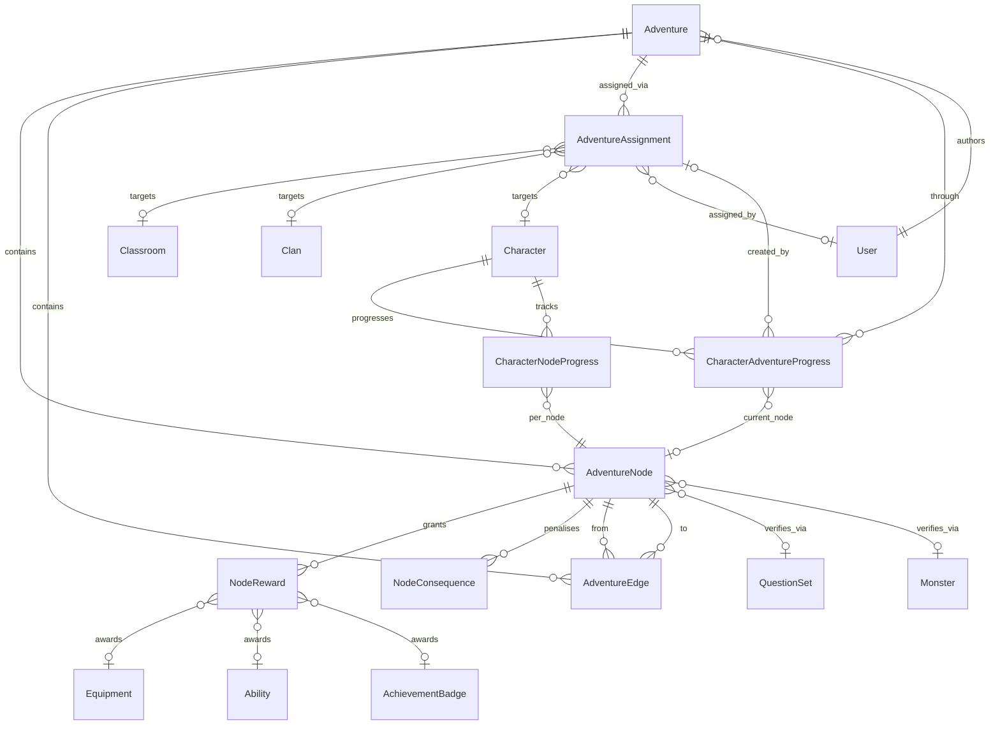

# Phase 1 — Data Model: Adventures Quest Map System

**Feature**: 001-adventures-map-system
**Date**: 2026-05-22
**Status**: Final for v1.

This document is the authoritative entity-by-entity description of the new schema. All names, types, constraints, indexes, and state machines below MUST be reflected verbatim in the Alembic migration `<ts>_add_adventure_tables.py` and the SQLAlchemy models in `app/models/adventure.py` and `app/models/adventure_progress.py`.

---

## Conventions

- Table names: plural, lowercase, underscored.
- All FKs declare an explicit `ondelete`. `CASCADE` for owning relationships (parent owns children outright); `SET NULL` for awarded items / external references (deleting the item should not orphan-cascade adventure progress).
- All enums are stored as `VARCHAR(N)` with application-level validation (per project portability rule R13 in research.md). The Python `Enum` is the source of truth.
- All `created_at` / `updated_at` columns are `DateTime` with `default=get_utc_now` / `onupdate=get_utc_now` (mirrors `app/utils/date_utils.py`).
- All primary keys are `Integer`, autoincrementing, named `id`.
- All `JSON` columns default to an empty dict (`{}`) where structurally a dict, or empty list (`[]`) where structurally a list. Never `NULL` unless the column is explicitly nullable.

---

## Enum reference (one place to look)

```python
# app/models/adventure.py

class AdventureStatus(str, Enum):
    DRAFT = "draft"
    PUBLISHED = "published"
    ARCHIVED = "archived"

class EndSemantics(str, Enum):
    ALL = "all"        # adventure complete iff every non-optional end-node completed (default)
    ANY = "any"        # adventure complete iff any end-node completed

class NodeType(str, Enum):
    START = "start"
    STORY = "story"
    BATTLE = "battle"
    QUIZ = "quiz"
    CHOICE = "choice"
    REWARD = "reward"
    MILESTONE = "milestone"
    BOSS = "boss"
    END = "end"

class EdgeConditionType(str, Enum):
    ALWAYS = "always"
    CHOICE = "choice"
    CRITERIA = "criteria"

class UnlockSemantics(str, Enum):
    AND = "and"
    OR = "or"

class RewardType(str, Enum):
    EXPERIENCE = "experience"
    GOLD = "gold"
    EQUIPMENT = "equipment"
    ABILITY = "ability"
    CLAN_EXPERIENCE = "clan_experience"
    SPECIAL_CURRENCY = "special_currency"
    BADGE = "badge"  # new; not present in legacy RewardType


# app/models/adventure_progress.py

class AdventureProgressStatus(str, Enum):
    NOT_STARTED = "not_started"
    IN_PROGRESS = "in_progress"
    COMPLETED = "completed"
    ABANDONED = "abandoned"

class NodeProgressStatus(str, Enum):
    LOCKED = "locked"
    AVAILABLE = "available"
    IN_PROGRESS = "in_progress"
    COMPLETED = "completed"
    FAILED = "failed"
    SKIPPED = "skipped"
```

Three new values are appended to `app/models/audit.py::EventType`:

```python
ADVENTURE_NODE_START = "ADVENTURE_NODE_START"
ADVENTURE_NODE_COMPLETE = "ADVENTURE_NODE_COMPLETE"
ADVENTURE_COMPLETE = "ADVENTURE_COMPLETE"
```

The `EVENT_TYPES` dict in `audit.py` is updated to include human-readable labels for each.

---

## 1. `adventures` — the reusable map template

| Column | Type | Null | Default | Notes |
|---|---|---|---|---|
| `id` | INTEGER PK | NO | autoinc | |
| `title` | VARCHAR(128) | NO | — | shown to teachers and students |
| `description` | TEXT | YES | NULL | short summary |
| `teacher_id` | INTEGER FK → `users.id` ON DELETE SET NULL | YES | NULL | author / owner |
| `background_image_url` | VARCHAR(512) | YES | NULL | path under `/static` or external URL |
| `theme` | VARCHAR(32) | YES | `"fantasy"` | influences default node icons |
| `width` | INTEGER | NO | `2000` | logical map width (px) |
| `height` | INTEGER | NO | `1500` | logical map height (px) |
| `status` | VARCHAR(16) | NO | `"draft"` | one of `AdventureStatus` |
| `is_public` | BOOLEAN | NO | `False` | shared with other teachers in the school |
| `end_semantics` | VARCHAR(8) | NO | `"all"` | one of `EndSemantics` |
| `version` | INTEGER | NO | `1` | bumped on any structural edit while published |
| `created_at` | DATETIME | NO | utc now | |
| `updated_at` | DATETIME | NO | utc now | onupdate utc now |

**Indexes**: `idx_adventures_teacher (teacher_id)`, `idx_adventures_status_public (status, is_public)`.

**Relationships**:
- `nodes` → `adventure_nodes` (1:N, cascade delete)
- `edges` → `adventure_edges` (1:N, cascade delete)
- `assignments` → `adventure_assignments` (1:N, cascade delete)
- `progress_rows` → `character_adventure_progress` (1:N, cascade delete)

**State machine** (`status`):
```
draft  --[publish]-->  published  --[archive]-->  archived
draft  --[archive]-->  archived
(no transitions out of archived; clone-to-draft is supported instead)
```

The `version` column increments by 1 on every structural change (node added/removed, edge added/removed/modified, node type changed) while `status = 'published'`. Cosmetic changes (`title`, `description`, `theme`) do not bump the version.

---

## 2. `adventure_nodes` — a placed task on the map

| Column | Type | Null | Default | Notes |
|---|---|---|---|---|
| `id` | INTEGER PK | NO | autoinc | |
| `adventure_id` | INTEGER FK → `adventures.id` ON DELETE CASCADE | NO | — | |
| `slug` | VARCHAR(64) | NO | — | stable string id within an adventure |
| `title` | VARCHAR(128) | NO | — | |
| `description` | TEXT | YES | NULL | |
| `lore` | TEXT | YES | NULL | flavour text |
| `icon_url` | VARCHAR(512) | YES | NULL | optional per-node icon override |
| `node_type` | VARCHAR(16) | NO | — | one of `NodeType` |
| `x` | FLOAT | NO | `0.0` | logical map x (px) |
| `y` | FLOAT | NO | `0.0` | logical map y (px) |
| `is_optional` | BOOLEAN | NO | `False` | optional nodes don't block adventure completion |
| `is_start` | BOOLEAN | NO | `False` | explicit start flag (in addition to implicit "no inbound") |
| `is_end` | BOOLEAN | NO | `False` | explicit end flag (in addition to implicit "no outbound") |
| `question_set_id` | INTEGER FK → `question_sets.id` ON DELETE SET NULL | YES | NULL | quiz/battle nodes |
| `monster_id` | INTEGER FK → `monsters.id` ON DELETE SET NULL | YES | NULL | battle/boss nodes |
| `completion_rules` | JSON | NO | `{}` | e.g. `{"min_score_percent": 80, "max_attempts": 3}` |
| `on_complete_actions` | JSON | NO | `{}` | e.g. `{"narrate": "...", "award_badge_id": 12}` |
| `created_at` | DATETIME | NO | utc now | |
| `updated_at` | DATETIME | NO | utc now | onupdate utc now |

**Constraints**:
- `UNIQUE (adventure_id, slug)` — slug is stable per adventure, used by URLs.
- `CHECK (x >= 0 AND y >= 0)` — clamp at the API layer too.

**Indexes**: `idx_nodes_adventure (adventure_id)`, `idx_nodes_adventure_type (adventure_id, node_type)`.

**Relationships**:
- `adventure` ↔ `adventures` (N:1)
- `outbound_edges` → `adventure_edges` (1:N, FK `from_node_id`)
- `inbound_edges` → `adventure_edges` (1:N, FK `to_node_id`)
- `rewards` → `node_rewards` (1:N, cascade delete)
- `consequences` → `node_consequences` (1:N, cascade delete)
- `progress_rows` → `character_node_progress` (1:N, cascade delete)

**Validation rules (enforced in `adventure_graph.validate_for_publish`)**:
- At least one node with `is_start=True` OR with no inbound edges. Block publish if absent.
- All `is_end=True` nodes must be reachable from at least one start. Block publish if not.
- No orphan non-optional nodes. Block publish.
- Choice node MUST have ≥ 2 outbound edges (each with distinct `condition_data.choice_key`). Warn only.
- Battle node SHOULD have a `monster_id`. Warn only (so teachers can save WIP).
- Quiz node SHOULD have a `question_set_id`. Warn only.
- Zero-node adventure. Block publish.

---

## 3. `adventure_edges` — directed connection between two nodes

| Column | Type | Null | Default | Notes |
|---|---|---|---|---|
| `id` | INTEGER PK | NO | autoinc | |
| `adventure_id` | INTEGER FK → `adventures.id` ON DELETE CASCADE | NO | — | denormalised for indexing |
| `from_node_id` | INTEGER FK → `adventure_nodes.id` ON DELETE CASCADE | NO | — | |
| `to_node_id` | INTEGER FK → `adventure_nodes.id` ON DELETE CASCADE | NO | — | |
| `label` | VARCHAR(128) | YES | NULL | shown on the edge in the editor / on a choice button |
| `condition_type` | VARCHAR(16) | NO | `"always"` | one of `EdgeConditionType` |
| `condition_data` | JSON | NO | `{}` | shape varies by `condition_type` (see below) |
| `unlock_semantics` | VARCHAR(8) | NO | `"and"` | one of `UnlockSemantics` |
| `sort_order` | INTEGER | NO | `0` | ordering of choice options |
| `created_at` | DATETIME | NO | utc now | |

**Constraints**:
- `UNIQUE (from_node_id, to_node_id)` — at most one edge between any ordered pair.
- `CHECK (from_node_id != to_node_id)` — no self-loops.

**Indexes**: `idx_edges_from (adventure_id, from_node_id)`, `idx_edges_to (adventure_id, to_node_id)`.

**`condition_data` shape**:
- `condition_type = "always"`: `{}` (must be empty).
- `condition_type = "choice"`: `{"choice_key": "<string>"}` — required.
- `condition_type = "criteria"`: e.g. `{"min_score_percent": 80}` or `{"completed_within_seconds": 120}` or `{"no_failed_attempts": true}` — at least one criterion required.

Validation enforced via Pydantic discriminated unions in `app/forms/adventure_schemas.py`.

---

## 4. `node_rewards` — rewards tied to a node

| Column | Type | Null | Default | Notes |
|---|---|---|---|---|
| `id` | INTEGER PK | NO | autoinc | |
| `node_id` | INTEGER FK → `adventure_nodes.id` ON DELETE CASCADE | NO | — | |
| `type` | VARCHAR(24) | NO | — | one of `RewardType` |
| `amount` | INTEGER | NO | `0` | applies to xp / gold / clan-xp / special-currency types |
| `item_id` | INTEGER FK → `equipment.id` ON DELETE SET NULL | YES | NULL | for `EQUIPMENT` |
| `ability_id` | INTEGER FK → `abilities.id` ON DELETE SET NULL | YES | NULL | for `ABILITY` |
| `badge_id` | INTEGER FK → `achievement_badge.id` ON DELETE SET NULL | YES | NULL | for `BADGE` |
| `is_conditional` | BOOLEAN | NO | `False` | if true, evaluated against `condition_json` at distribute time |
| `condition_json` | JSON | NO | `{}` | e.g. `{"min_score_percent": 90}` |

**Indexes**: `idx_node_rewards_node (node_id)`.

**Validation** (Pydantic + service):
- `type = EXPERIENCE | GOLD | CLAN_EXPERIENCE | SPECIAL_CURRENCY` → `amount > 0` required; `item_id`, `ability_id`, `badge_id` must all be NULL.
- `type = EQUIPMENT` → `item_id` required.
- `type = ABILITY` → `ability_id` required.
- `type = BADGE` → `badge_id` required.

---

## 5. `node_consequences` — penalties on max-attempts failure

| Column | Type | Null | Default | Notes |
|---|---|---|---|---|
| `id` | INTEGER PK | NO | autoinc | |
| `node_id` | INTEGER FK → `adventure_nodes.id` ON DELETE CASCADE | NO | — | |
| `description` | TEXT | YES | NULL | shown to student on max-fail |
| `xp_penalty` | INTEGER | NO | `0` | |
| `gold_penalty` | INTEGER | NO | `0` | |
| `hp_penalty` | INTEGER | NO | `0` | |
| `custom_json` | JSON | NO | `{}` | future penalty types |

**Indexes**: `idx_node_consequences_node (node_id)`.

---

## 6. `adventure_assignments` — binds an Adventure to a target

| Column | Type | Null | Default | Notes |
|---|---|---|---|---|
| `id` | INTEGER PK | NO | autoinc | |
| `adventure_id` | INTEGER FK → `adventures.id` ON DELETE CASCADE | NO | — | |
| `adventure_version` | INTEGER | NO | — | snapshot of `adventures.version` at assignment time |
| `classroom_id` | INTEGER FK → `classrooms.id` ON DELETE SET NULL | YES | NULL | exactly one of (classroom, clan, character) is non-null |
| `clan_id` | INTEGER FK → `clans.id` ON DELETE SET NULL | YES | NULL | (Phase 5 — clan-level) |
| `character_id` | INTEGER FK → `characters.id` ON DELETE SET NULL | YES | NULL | (Phase 5 — individual student) |
| `assigned_by_user_id` | INTEGER FK → `users.id` ON DELETE SET NULL | YES | NULL | the teacher who created the assignment |
| `starts_at` | DATETIME | YES | NULL | optional start window |
| `ends_at` | DATETIME | YES | NULL | optional end window |
| `is_active` | BOOLEAN | NO | `True` | soft-disable |
| `created_at` | DATETIME | NO | utc now | |

**Constraints**:
- App-level (and DB-level CHECK where supported): exactly one of (`classroom_id`, `clan_id`, `character_id`) must be non-NULL. SQLite CHECK form:
  `((classroom_id IS NOT NULL) + (clan_id IS NOT NULL) + (character_id IS NOT NULL)) = 1`.
- `CHECK (starts_at IS NULL OR ends_at IS NULL OR ends_at > starts_at)`.

**Indexes**: `idx_assignments_adventure_active (adventure_id, is_active)`, `idx_assignments_classroom (classroom_id, is_active)`, `idx_assignments_clan (clan_id, is_active)`, `idx_assignments_character (character_id, is_active)`.

---

## 7. `character_adventure_progress` — per-character standing in an adventure

| Column | Type | Null | Default | Notes |
|---|---|---|---|---|
| `id` | INTEGER PK | NO | autoinc | |
| `character_id` | INTEGER FK → `characters.id` ON DELETE CASCADE | NO | — | |
| `adventure_id` | INTEGER FK → `adventures.id` ON DELETE CASCADE | NO | — | |
| `assignment_id` | INTEGER FK → `adventure_assignments.id` ON DELETE SET NULL | YES | NULL | which assignment first created this row |
| `snapshot_json` | JSON | YES | NULL | optional full-snapshot for v2+ (NULL in v1) |
| `status` | VARCHAR(16) | NO | `"not_started"` | one of `AdventureProgressStatus` |
| `current_node_id` | INTEGER FK → `adventure_nodes.id` ON DELETE SET NULL | YES | NULL | last node student opened |
| `started_at` | DATETIME | YES | NULL | set on first node-start |
| `completed_at` | DATETIME | YES | NULL | set when status → completed |
| `last_active_at` | DATETIME | YES | NULL | updated on every node action |

**Constraints**:
- `UNIQUE (character_id, adventure_id)`.

**Indexes**: `idx_char_adv_progress_status (character_id, status)`, `idx_char_adv_progress_assignment (assignment_id)`.

**State machine** (`status`):
```
not_started --[first node started]-->  in_progress
in_progress --[all required end nodes complete]-->  completed
in_progress --[teacher 'force complete']-->  completed
in_progress --[teacher unassign + no remaining assignments]-->  abandoned
```

---

## 8. `character_node_progress` — per-character per-node standing

| Column | Type | Null | Default | Notes |
|---|---|---|---|---|
| `id` | INTEGER PK | NO | autoinc | |
| `character_id` | INTEGER FK → `characters.id` ON DELETE CASCADE | NO | — | |
| `node_id` | INTEGER FK → `adventure_nodes.id` ON DELETE CASCADE | NO | — | |
| `status` | VARCHAR(16) | NO | `"locked"` | one of `NodeProgressStatus` |
| `attempts` | INTEGER | NO | `0` | incremented on each `/start` after the first |
| `score` | INTEGER | YES | NULL | last attempt's score (0–100), nullable for non-scored nodes |
| `progress_data` | JSON | NO | `{}` | task-specific (e.g. `{"battle_id": 1234}`) |
| `choice_made` | VARCHAR(64) | YES | NULL | for choice nodes — which `choice_key` the student picked |
| `started_at` | DATETIME | YES | NULL | first transition to `in_progress` |
| `completed_at` | DATETIME | YES | NULL | transition to `completed` |
| `updated_at` | DATETIME | NO | utc now | onupdate utc now |

**Constraints**:
- `UNIQUE (character_id, node_id)`.

**Indexes**: `idx_char_node_progress_status (character_id, status)`, `idx_char_node_progress_node (node_id, status)`.

**State machine** (`status`):
```
locked --[unlocked by graph re-eval]-->  available
available --[student opens node]-->  in_progress
in_progress --[verification passes]-->  completed
in_progress --[verification fails, attempts < max]-->  failed
failed --[student retries]-->  available
in_progress --[verification fails, attempts >= max]-->  failed (terminal; consequences applied once)
available / failed --[adventure complete & node not visited, is_optional=True]--> skipped
```

---

## Entity-relationship diagram



---

## Cross-cutting invariants

These invariants are enforced by service-layer code (`adventure_graph.py`, `adventure_rewards.py`) and verified by tests in `tests/test_adventure_graph_unlock.py` and `tests/test_adventure_rewards.py`.

1. **Strict additivity (FR-036)**: No FK in this schema points into legacy `quests` or `quest_logs`. No legacy column is added or changed. Verified by `tests/test_quest_models.py` passing unchanged.
2. **Atomic reward distribution (FR-030)**: `adventure_rewards.distribute_node_rewards(character, node, score, session, commit=False)` opens no nested transactions; it adds rows / mutates character columns / writes audit logs in the caller's session and never commits early.
3. **Idempotent transitions (FR-033, R11)**: every state-changing service method first locks the row (`with_for_update()` on engines that support it), reads current status, and is a no-op when already in the target state.
4. **AND/OR unlock correctness (FR-012, FR-032, R6)**: `adventure_graph.recompute_unlocks_for_character(character)` evaluates the AND group fully before checking the OR group, and short-circuits on cycle revisits using a visited-set.
5. **Snapshot pinning (FR-039, R2)**: `character_adventure_progress.assignment_id` is the canonical link to a snapshotted version. The player reads node/edge data through that assignment's `adventure_version`. For v1 the `_v2` historical rows are not stored separately — version is only an integer pin — so mid-flight teacher edits to the LATEST version don't affect in-progress students because the player resolves nodes by `(adventure_id, version=assignment.adventure_version)`. When the assignment_id has been NULLed (deleted assignment), the player falls back to the latest version, which is acceptable because the assignment has been retired by the teacher.

> **NOTE on snapshot pinning v1 limitation**: in v1, since old versions are not stored, the version pin alone cannot reconstruct history if a teacher rewrites the adventure between drafts. This v1 limitation is acceptable for the spec's Acceptance Scenario 5.1 because we forbid structural edits *to a published Adventure* without bumping the version, and v1 will refuse to let teachers edit a published Adventure directly — they must clone-and-edit. Phase 4 introduces a true `snapshot_json` write-on-assignment to remove this restriction. This is captured in research.md (R2).

---

## Migration outline (`<ts>_add_adventure_tables.py`)

```python
def upgrade():
    # 1. adventures
    op.create_table("adventures", ...)
    op.create_index("idx_adventures_teacher", "adventures", ["teacher_id"])
    op.create_index("idx_adventures_status_public", "adventures", ["status", "is_public"])

    # 2. adventure_nodes
    op.create_table("adventure_nodes", ...)
    op.create_index("idx_nodes_adventure", "adventure_nodes", ["adventure_id"])
    op.create_index("idx_nodes_adventure_type", "adventure_nodes", ["adventure_id", "node_type"])

    # 3. adventure_edges
    op.create_table("adventure_edges", ...)
    op.create_index("idx_edges_from", "adventure_edges", ["adventure_id", "from_node_id"])
    op.create_index("idx_edges_to", "adventure_edges", ["adventure_id", "to_node_id"])

    # 4. node_rewards
    op.create_table("node_rewards", ...)
    op.create_index("idx_node_rewards_node", "node_rewards", ["node_id"])

    # 5. node_consequences
    op.create_table("node_consequences", ...)
    op.create_index("idx_node_consequences_node", "node_consequences", ["node_id"])

    # 6. adventure_assignments
    op.create_table("adventure_assignments", ...)
    op.create_index("idx_assignments_adventure_active", "adventure_assignments", ["adventure_id", "is_active"])
    op.create_index("idx_assignments_classroom", "adventure_assignments", ["classroom_id", "is_active"])
    op.create_index("idx_assignments_clan", "adventure_assignments", ["clan_id", "is_active"])
    op.create_index("idx_assignments_character", "adventure_assignments", ["character_id", "is_active"])

    # 7. character_adventure_progress
    op.create_table("character_adventure_progress", ...)
    op.create_index("idx_char_adv_progress_status", "character_adventure_progress", ["character_id", "status"])
    op.create_index("idx_char_adv_progress_assignment", "character_adventure_progress", ["assignment_id"])

    # 8. character_node_progress
    op.create_table("character_node_progress", ...)
    op.create_index("idx_char_node_progress_status", "character_node_progress", ["character_id", "status"])
    op.create_index("idx_char_node_progress_node", "character_node_progress", ["node_id", "status"])

def downgrade():
    op.drop_table("character_node_progress")
    op.drop_table("character_adventure_progress")
    op.drop_table("adventure_assignments")
    op.drop_table("node_consequences")
    op.drop_table("node_rewards")
    op.drop_table("adventure_edges")
    op.drop_table("adventure_nodes")
    op.drop_table("adventures")
```

CHECK constraints are added inline in the `create_table()` calls (`sa.CheckConstraint(...)`).

After the migration runs, `alembic upgrade head` should report a clean upgrade, and the workspace rule (`.cursor/rules/database-management.mdc`) demands we run this immediately whenever the DB is reset.

---

## Mapping back to functional requirements

| FR | Covered by |
|---|---|
| FR-001 (CRUD adventures) | `adventures` + Adventure model |
| FR-002 (background image) | `adventures.background_image_url` |
| FR-003 (place typed nodes) | `adventure_nodes.node_type` + position |
| FR-004 (drag to reposition) | `adventure_nodes.x/y` updates |
| FR-005 (draw/delete connections) | `adventure_edges` |
| FR-006 (per-node fields) | `adventure_nodes` fields incl. `completion_rules`, `question_set_id`, `monster_id` |
| FR-007 (per-node rewards, conditional) | `node_rewards` + `is_conditional` + `condition_json` |
| FR-008 (per-node consequences) | `node_consequences` |
| FR-009 (optional nodes) | `adventure_nodes.is_optional` |
| FR-010 (explicit start/end) | `is_start`, `is_end` |
| FR-011 (edge conditions) | `adventure_edges.condition_type` + `condition_data` |
| FR-012 (AND/OR re-join) | `adventure_edges.unlock_semantics` |
| FR-013 (validation) | `adventure_graph.validate_for_publish` + UI mirror |
| FR-014 (save / publish) | `adventures.status` enum + version bump on publish |
| FR-015 (preview as student) | service-mode flag on student state endpoint; no progress row written |
| FR-016 (assign to class) | `adventure_assignments.classroom_id` (others nullable for now) |
| FR-017 (start/end dates) | `starts_at` / `ends_at` |
| FR-018 (deactivate without delete) | `is_active` |
| FR-019 (clone) | service: copy adventure → clone → reset `version=1, status='draft'` |
| FR-020 (per-student progress) | `character_adventure_progress` + `character_node_progress` joined |
| FR-021 (force complete override) | service method + audit log; flag in audit event_data |
| FR-022 (student adventure list) | join via `adventure_assignments` |
| FR-023 (rendered map) | client renders from `GET /student/adventures/<id>/state` |
| FR-024 (visual states) | `NodeProgressStatus` |
| FR-025 (detail panel) | static partial `_adventure_node_detail.html` |
| FR-026 (battle bound to node) | `progress_data.battle_id` + `adventure_hooks.on_battle_resolved` |
| FR-027 (quiz with pass threshold) | `completion_rules.min_score_percent` + quiz route |
| FR-028 (story/reward/milestone/end) | single complete endpoint |
| FR-029 (choice node) | `/choose` endpoint + `character_node_progress.choice_made` |
| FR-030 (atomic reward distribution) | `adventure_rewards.distribute_node_rewards(commit=False)` |
| FR-031 (consequences on max-fail) | `apply_node_consequences` invoked once at the max-attempts threshold |
| FR-032 (downstream unlock recompute) | `adventure_graph.recompute_unlocks_for_character` |
| FR-033 (idempotency) | row-lock + status-check pattern in services |
| FR-034 (adventure complete event) | `EndSemantics` evaluation + `ADVENTURE_COMPLETE` audit event |
| FR-035 (start/end date messaging) | client honours `starts_at` / `ends_at` |
| FR-036 (additive only) | regression: `tests/test_quest_models.py` passes unchanged |
| FR-037 (ownership scoping) | `Adventure.teacher_id` + `@teacher_required` guard |
| FR-038 (audit trail) | three new `EventType`s |
| FR-039 (mid-flight stability) | snapshot pinning (R2) |
| FR-040 (per-action authorisation) | guards in routes calling shared `_authorise(...)` helpers |
