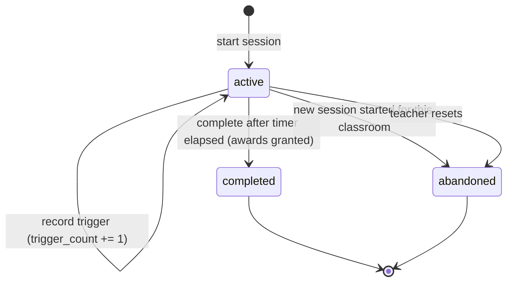
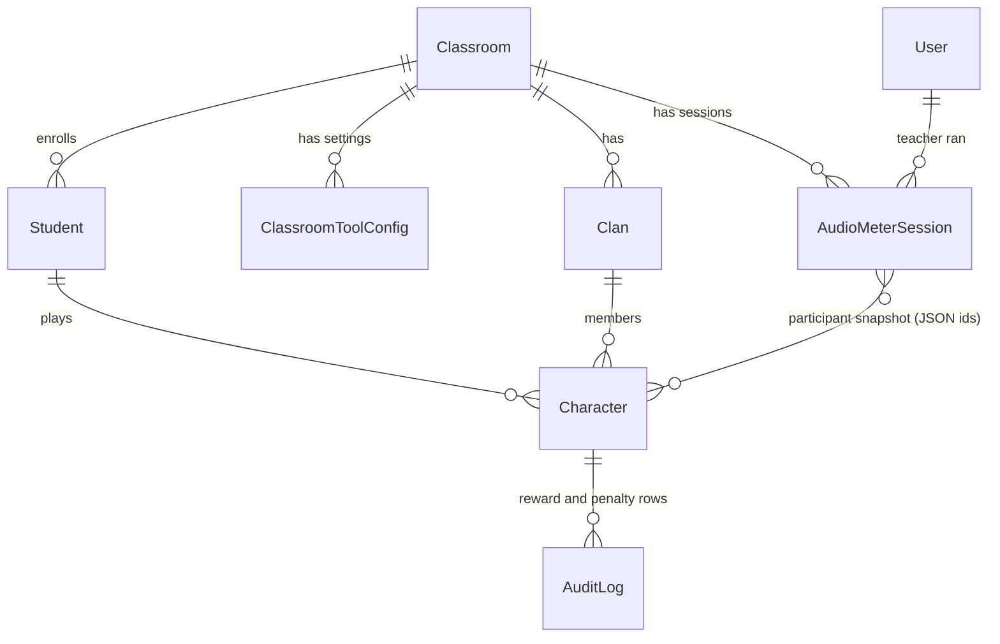

# Phase 1 Data Model: Audio Meter Targeting

**Feature**: 005-audio-meter-targeting
**Date**: 2026-09-21
**Spec**: [spec.md](spec.md) | **Research**: [research.md](research.md)

One new table. One new key on an existing JSON settings column. No changes to `characters`, `clans`, `students`, or any behavior table.

---

## New: `AudioMeterSession`

**Module**: `app/models/audio_meter.py`
**Table**: `audio_meter_sessions`
**Purpose**: one timed quiet-time run for a classroom. Holds the participant snapshot, the settings locked at start, and the authoritative trigger count that determines the payout.

### Enum

```python
class AudioMeterSessionStatus(str, enum.Enum):
    """Lifecycle state of one audio meter session."""

    ACTIVE = "active"
    COMPLETED = "completed"
    ABANDONED = "abandoned"
```

Follows the `str, enum.Enum` pattern already used by `FallenStatus` in `app/models/behavior.py`.

### Columns

| Column | Type | Null | Notes |
|--------|------|------|-------|
| `id` | Integer | no | Primary key |
| `classroom_id` | Integer FK → `classrooms.id` | no | `ondelete='CASCADE'`, indexed |
| `teacher_user_id` | Integer FK → `users.id` | no | `ondelete='CASCADE'`. Who ran the session |
| `status` | String(16) | no | One of `AudioMeterSessionStatus`, default `active`, indexed |
| `target_type` | String(16) | no | `class` or `custom` |
| `target_clan_ids` | JSON | no | List of clan ids the teacher selected; `[]` for whole class |
| `target_student_ids` | JSON | no | List of student ids the teacher selected; `[]` for whole class |
| `participant_character_ids` | JSON | no | Deduplicated resolved character ids, snapshotted at start |
| `base_xp` | Integer | no | Locked from settings at start |
| `base_gold` | Integer | no | Locked from settings at start |
| `timer_seconds` | Integer | no | Locked session length, from `timer_minutes * 60` |
| `hp_damage_enabled` | Boolean | no | Locked at start, default `False` |
| `hp_damage_amount` | Integer | no | Locked at start; only meaningful when the flag is true |
| `trigger_count` | Integer | no | Default 0. Server-incremented; the only input to the tier |
| `started_at` | DateTime | no | Set at start; basis for the elapsed-time check |
| `completed_at` | DateTime | yes | Set when status becomes `completed` |
| `xp_awarded_each` | Integer | yes | Final per-character XP, recorded for audit |
| `gold_awarded_each` | Integer | yes | Final per-character gold, recorded for audit |
| `created_at` / `updated_at` | DateTime | no | Inherited from `Base` |

### Constraints and indexes

- `Index('idx_audio_meter_session_classroom_status', 'classroom_id', 'status')` — supports the "is there an active session for this classroom" lookup that enforces FR-020.
- No unique constraint on `classroom_id`: completed and abandoned rows are retained as history. The one-active-session rule is enforced in `app/services/audio_meter.py` inside the start transaction (research D6).

### Relationships

```python
classroom = db.relationship(
    "Classroom",
    backref=db.backref("audio_meter_sessions", lazy="dynamic"),
)
teacher = db.relationship("User", backref=db.backref("audio_meter_sessions", lazy="dynamic"))
```

### Registration checklist

- Import in `app/models/__init__.py` inside `init_db()` (the repo does not auto-discover models).
- Import in `migrations/env.py` so Alembic autogenerate sees the table.
- Generate the revision, then run `alembic upgrade head`.

---

## Modified: volume meter settings JSON

**Location**: `classroom_tool_configs.config_data` where `tool_type = 'volume_meter'`. No schema change; `DEFAULT_VOLUME_CONFIG` in `app/routes/teacher/classroom_tools.py` gains one key.

| Key | Type | Default | Change |
|-----|------|---------|--------|
| `threshold` | float | 0.35 | unchanged |
| `breach_duration_seconds` | int | 5 | unchanged |
| `breach_cooldown_seconds` | int | 2 | unchanged |
| `damage_amount` | int | 10 | unchanged; now only applied when the flag below is true |
| `timer_minutes` | int | 15 | unchanged |
| `base_xp_reward` | int | 50 | unchanged |
| `base_gold_reward` | int | 25 | unchanged |
| `hp_damage_enabled` | bool | `False` | **NEW** |

No data migration is needed: `_merge_volume_config` already fills any key missing from a stored row out of `DEFAULT_VOLUME_CONFIG`, so existing classroom rows gain `hp_damage_enabled = False` automatically. This is what makes FR-015's "defaults to off" true for classes configured before this feature.

---

## Derived values (not stored)

### Reward tier

```python
def tier_amount(base: int, triggers: int) -> int:
    """Reward after n triggers: ceil(base / 2**n), never below 1 when base > 0."""
    if base <= 0:
        return 0
    return max(1, -(-base // (2 ** min(triggers, 40))))
```

| triggers | base 1000 XP | base 100 gold |
|----------|--------------|---------------|
| 0 | 1000 | 100 |
| 1 | 500 | 50 |
| 2 | 250 | 25 |
| 3 | 125 | 13 |
| 4 | 63 | 7 |
| many | 1 | 1 |

The exponent is clamped so a pathological trigger count cannot trigger big-integer work; the result is pinned at 1 long before the clamp matters.

### Participant resolution

```text
target_type == "class"   → every active character of every active student in the classroom
target_type == "custom"  → union of:
                             active characters of students in each selected clan
                             active characters of each selected student
```

Resolution rules:
- Deduplicate by character id, satisfying FR-004 (selected via clan *and* individually still awards once).
- Skip students with no active character; they are counted as skipped and reported, satisfying the spec's edge case.
- Reject any clan or student that does not belong to the target classroom with a 400, before any session row is written.
- Run once, at start. The stored snapshot is the authority for every later trigger and for completion.

---

## State transitions



Invariants:

- Awards are written only on the `active → completed` edge, so FR-012 holds: reset, supersede, and reload all leave the attempt unpaid.
- `trigger_count` only ever increments, and only while `status == active`. A trigger against a completed or abandoned session is a 409.
- `completed_at`, `xp_awarded_each`, and `gold_awarded_each` are non-null exactly when `status == completed`.
- A reload leaves the row `active` with nobody driving it; the next start abandons it (research D6). There is no durable resume.

---

## Audit records written

Reuses the existing `TOOL_REWARD` and `TOOL_PENALTY` members of `EventType`, so no enum migration is required.

### Per-character reward row (one per rewarded character)

`event_type = TOOL_REWARD`, `character_id` set, `user_id` = teacher.

```json
{
  "tool": "volume_meter",
  "session_id": 12,
  "classroom_id": 17,
  "base_xp": 1000,
  "base_gold": 100,
  "trigger_count": 2,
  "xp_awarded": 250,
  "gold_awarded": 25,
  "description": "Quiet-time reward: 250 XP and 25 gold (halved twice after 2 noise triggers)"
}
```

The `description` key is what makes this visible to students: the Progress page activity feed filters `AuditLog.character_id == character.id` and renders `event_data['description']`, so FR-014 and SC-006 are met without student-side changes. Today's implementation writes only a batch row with `character_id=None`, which never reaches that feed.

### Batch summary row (one per completion)

`event_type = TOOL_REWARD`, `character_id = None`, carrying `rewarded_character_ids`, `skipped_student_ids`, `count`, and the same session fields. Mirrors the shape the current `api_volume_reward` already logs.

### Penalty rows (only when `hp_damage_enabled`)

`event_type = TOOL_PENALTY`, one per damaged character plus a batch summary, carrying `session_id`, `damage_amount`, and `trigger_count`. Deliberately not a `BehaviorIncident`: routing through `app/services/behavior.py` would create behavior incidents and possibly `FallenEvent` rescue windows, which FR-025 excludes.

---

## Entity relationships



The participant link is a JSON id list rather than an association table: it is written once, read as a whole, and never queried by participant (research D2).
